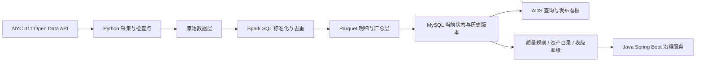

# 城市公共服务工单离线数仓与数据治理平台

基于 NYC Open Data 311 公共服务工单构建的个人数据工程项目。项目处理 2025 年 **3,655,040 条唯一工单**，重点验证批量采集、Spark SQL 数仓加工、MySQL 可靠加载、数据质量与资产治理，以及 Java 治理服务的完整工程链路。

## 项目成果

| 模块 | 实现内容 | 可复查证据 |
| --- | --- | --- |
| 数据采集 | Python 复合游标分页、失败重试、检查点续跑、分批对账 | `src/ingest/`、`reports/ingest/` |
| 数仓加工 | Spark SQL 字段标准化、质量标记、主键去重、Parquet 分区写入 | `src/transform/`、`reports/spark/` |
| 可靠加载 | 24 个分块事务、内容哈希、幂等合并、提交回执丢失恢复 | `src/load/`、`tests/test_reliability.py` |
| 查询优化 | 复合索引、ADS 汇总表、MySQL 与 Parquet 查询对照 | `sql/queries/`、`reports/p4/` |
| 数据治理 | 10 项质量规则、8 项数据资产、7 条表级血缘 | `src/governance/`、`reports/p7/` |
| Java 服务 | Spring Boot、Spring JDBC、事务、唯一任务键、乐观锁与失败重试 | `java-governance-service/`、`reports/p8/`、`reports/p9/` |

## 架构



## 核心工程设计

- 使用 `(created_date, unique_key)` 稳定复合游标替代深分页，页级完成后记录检查点。
- 将当前状态表与历史版本表分离，仅在内容哈希变化时追加历史版本。
- 将分块检查点与数据合并放入同一事务；客户端在提交后失去回执时，重连查询持久化检查点再决定是否重试。
- 使用发布登记表隔离失败批次，只有通过数量与质量闸门的版本才能成为活动版本。
- Java 服务仅承担治理元数据和质量任务控制，批量 ETL 继续由 Python 与 Spark SQL 执行。
- 通过唯一任务键保证幂等提交，使用 `version_no` 乐观锁避免并发状态覆盖，并按重试额度处理失败任务。

## 技术栈

- **数据开发：** Python、PySpark 4.0.4、Spark SQL、Parquet
- **数据库：** MySQL 8.4、SQL、复合索引、事务、增量合并
- **治理服务：** Java 17、Spring Boot、Spring JDBC、REST API
- **工程验证：** 分层对账、质量规则、故障恢复测试、执行计划与查询基准

## 目录结构

```text
configs/                    配置样例与治理规则
dags/                       Airflow 部署参考 DAG
dashboard/                  静态交付看板
java-governance-service/    Java 数据治理服务
reports/                    各阶段报告与机器可读结果
scripts/                    Windows 本地编排脚本
sql/                        MySQL DDL 与基准查询
src/                        采集、转换、加载、治理、分析与编排代码
tests/                      可靠性集成测试
```

## 快速查看与复现

仅验证公开 API 和字段契约：

```powershell
python -m venv .venv
.venv\Scripts\pip install -r requirements.txt
.venv\Scripts\python src\ingest\p0_probe.py --counts-only
.venv\Scripts\python src\ingest\p0_probe.py --sample-limit 50000
```

完整链路需要 Java 17、Spark、Hadoop Windows 辅助程序及 MySQL。复制配置样例后填写本地参数：

```powershell
Copy-Item configs\mysql\.env.example .env
scripts\run_spark.ps1
scripts\load_baseline.ps1
.venv\Scripts\python.exe tests\test_reliability.py
scripts\run_governance.ps1
```

本项目在 Windows 单机开发环境完成，`scripts/` 中保留了实验环境的默认运行目录。迁移到其他机器时需按本机安装位置调整 Java、Hadoop 与 MySQL 路径；数据处理代码、SQL、表结构及验证报告均已纳入版本控制。

## 验证状态

- Python 源码通过 `compileall` 语法检查。
- Java 治理服务的 9 项单元测试通过。
- MySQL 可靠性测试覆盖重复输入、业务变更、提交回执丢失和失败版本隔离。
- 规模、质量、查询和联调结果保存在 `reports/`，未测量的优化比例未写入项目结论。

## 数据与安全边界

- 原始数据、Parquet 文件、MySQL 数据目录、虚拟环境、构建产物和 `.env` 均由 `.gitignore` 排除。
- 仓库只保留公共数据的小型脱敏字段样例、聚合结果和验证报告。
- 项目使用 Spark local 模式完成工程验证，不表述为生产分布式集群。
- 数据源是公开 API，不表述为实时 CDC 或 exactly-once 分布式事务。
- `dags/` 为部署参考，未声称 Airflow 已在生产环境运行。

## 详细文档

- `NYC311_大样本数仓项目方案_V1.md`：范围、架构、数据模型与验收标准。
- `难点记录.md`：开发中实际遇到的问题、原因、处理与验证。
- `项目技术知识手册.md`：项目实际使用的 MySQL、Spark SQL、数仓与治理知识。
- `reports/p7/P7_数据质量与数据资产报告.md`：质量规则、资产目录和血缘结果。
- `reports/p9/P9_Java质量任务管理报告.md`：Java 任务状态机、事务、乐观锁和重试验证。
